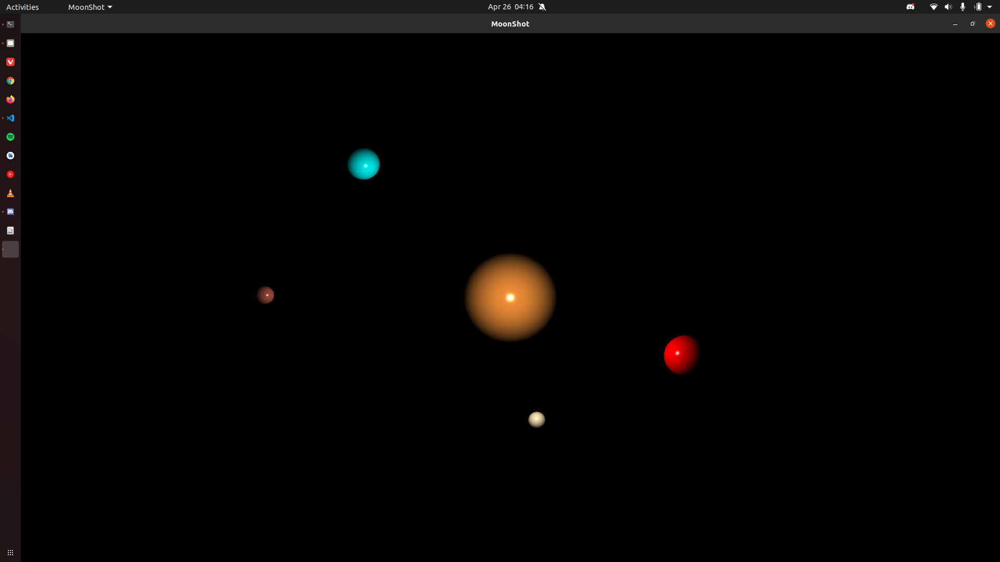
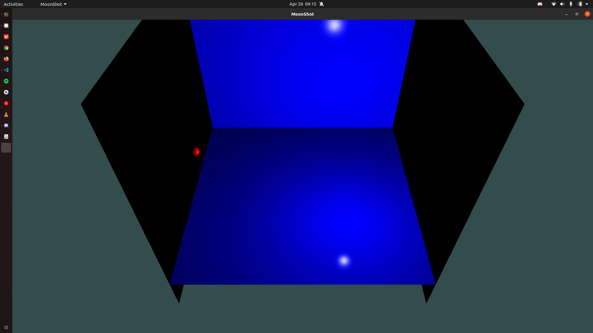
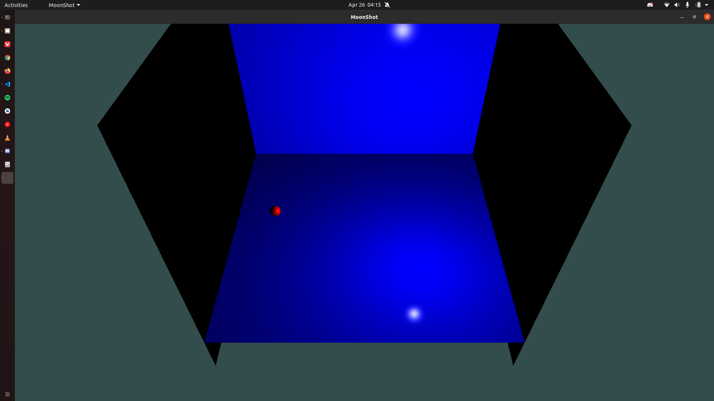

# Computer Graphics - Project
Basic Physics Engine for collision and gravity simulation between primitive objects like Spheres and Planes.

## Results

# Team
- G Sathyaram ["wreck-count"](https://github.com/wreck-count)
- Sivaraman Karthik Rangasai ["karthikrangasai"](https://github.com/karthikrangasai)
- R Sai Rajaji ["rajajisai"](https://github.com/rajajisai)