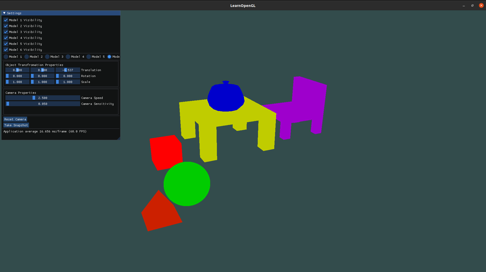
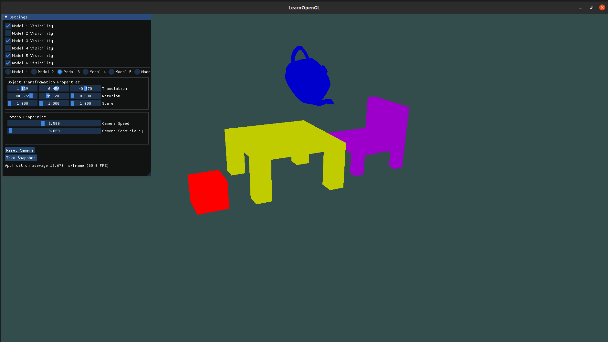
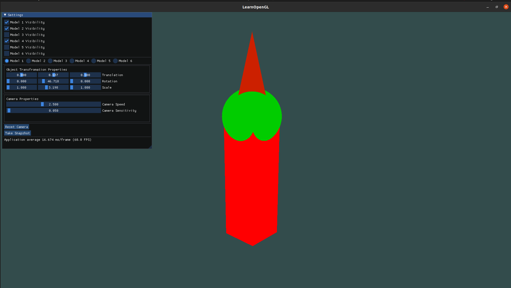
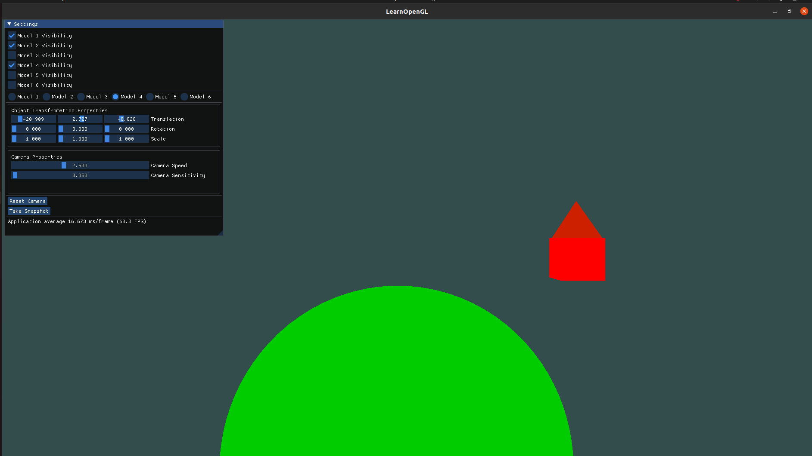
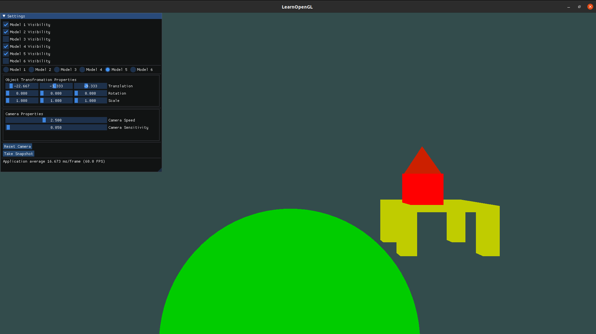

# Computer Graphics - Assignment 2
Understanding OpenGL transformation, matrix stack operations, and 3D viewing pipeline.

## Results

# Issues in Coding
- Generating a unique shader for loading all models.
- Implementing different functions for various Camera Movements, especially rotate about center camera view.
- Keeping affine transforms of each object unique with its own properties.
- Adding GUI to control the Objects in the Scene.

# Team
- G Sathyaram ["wreck-count"](https://github.com/wreck-count)
- Sivaraman Karthik Rangasai ["karthikrangasai"](https://github.com/karthikrangasai)
- R Sai Rajaji ["rajajisai"](https://github.com/rajajisai)